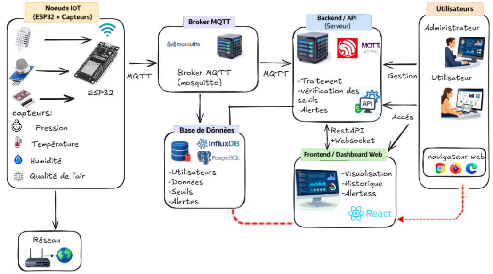

## Schéma de l'architecture système:

## Description fonctionnelle de l'architecture

Le système repose sur une architecture IoT de bout en bout découpée en quatre couches principales :

## 1. Couche Collecte et Acquisition (Noeud IoT) :
 Des microcontrôleurs ESP32 collectent en continu les données environnementales issues de différents capteurs (Pression, Température, Humidité, Qualité de l'air). Ces nœuds sont connectés au réseau internet via une passerelle (Routeur/Box) et transmettent les mesures brutes en utilisant le protocole léger MQTT ou HTTP.

## 2. Couche Transport   :
 Un serveur de messagerie Mosquitto (Broker MQTT) centralise la réception des messages envoyés par les ESP32. Il distribue efficacement ces flux de données vers le serveur d'application et la base de données.
 ou les données sont envoyées via le protocole HTTP,arrivant au script python pont "data-sender.py".

## 3. Couche Traitement, Logique et Stockage (backend): 
   **Backend / API** : Développé d'une manière asynchrone, le serveur prend en charge le traitement des données reçues, la vérification des seuils critiques et la génération des alertes. Il expose également une API REST et des connexions WebSockets pour communiquer avec le Front-end.
    **Base de données** : Le système s'appuie sur une architecture hybride. PostgreSQL gère les données relationnelles (profils utilisateurs, configuration des seuils, historiques d'alertes), tandis qu'InfluxDB (base de données de séries temporelles) stocke l'historique massif des métriques des capteurs.

## 4. Couche Présentation (Interface Utilisateur) : 
Les utilisateurs (Administrateurs et Utilisateurs standards) accèdent à l'application via un navigateur web classique. Le Dashboard Web, développé en React, communique avec l'API en temps réel (WebSockets pour l'affichage instantané, REST pour l'historique et la gestion) afin de proposer une visualisation fluide des données, de l'historique et des alertes actives.

