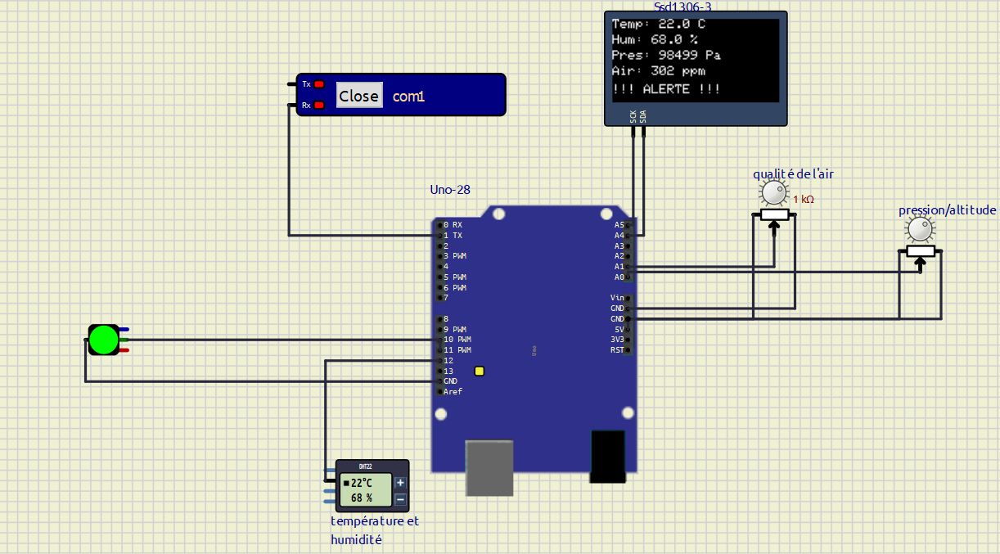

# Documentation technique ( plan de mise en plcae de l'environnement du travail en local):

Avant de lancer le projet, assurez-vous d’installer les outils suivants :

le logiciel de simulation SimulIDE téléchargeable à partir du lien suivant :
https://simulide.com/p/downloads/

le simulateur Arduino IDE 2.3.8 téléchargeable à partir du lien suivant:
https://support.arduino.cc/hc/en-us/articles/360019833020-Download-and-install-Arduino-IDE

python 3.13 téléchargeable à partir du lien suivant:
https://www.python.org/downloads/

PostgreSQL le système de gestion de base de données relationnelle téléchargeable à partir du lien suivant:
https://www.postgresql.org/download/

## étapes à suivre pour lancer le projet:

1-lancer la simulation:
lancer le fichier du montage nommé "montage.sim1" situé dans l'emplacement suivant: "simulation/montage.sim1"
charger le firmware Arduino IDE, exporté sous format binaire situé dans l'emplacement suivant:"firmware/build/arduino.avr.uno/firmware.ino.hex" dans la carte Arduino-Uno

faire un clic droit sur la carte Arduino Uno
choisir "charger" le firmware"
sélectionner le fichier :firmware.ino.hex.
lancer la simulation.

2-Envoyer les données vers la base de données:
Exécuter le script python (en tapant la commande data-sender.py dans le terminal)situé dans l'emplacement suivant:"simulation/data-sender.py".
ce script permet envoyer les mesures en temps réel vers la base de données.

.Résultat attendu:
Simulation fonctionnelle dans SimulIDE.
Données générées par les capteurs.
Envoi des données en temps réel.
Stockage automatique dans PostgreSQL.
